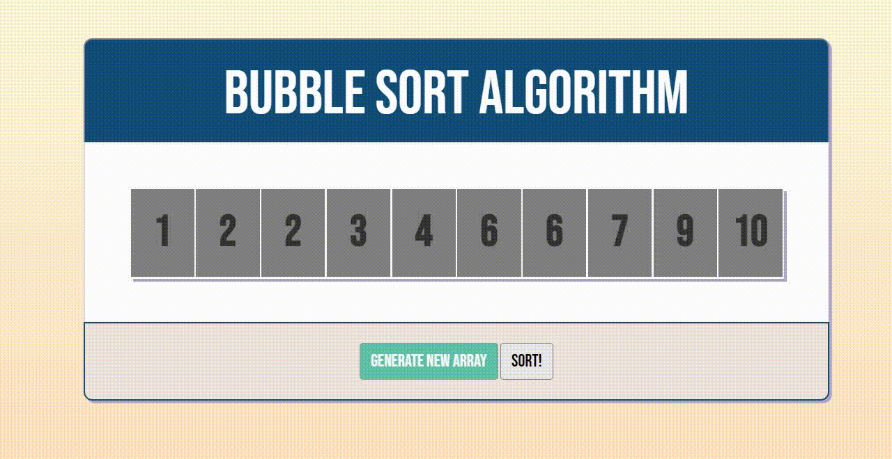

# BubbleSort Algorithm

## Apresentação
Permite que o usuário gere novos arrays e os ordene utiliziando o algoritmo de ordenação bubblesort.

## Preview

## Tecnologias utilizadas 
- HTML
- CSS
- Javascript

## Bibliotecas utilizadas
- JQuery
- Bootstrap

## Deploy
[Clique aqui para acessar o link](https://serpicode.github.io/BubbleSort-Algorithm/)

## Contato
Email: luisvviana2002@gmail.com
